# Threat modeling for a mobile app
### Cyber Security Project

GitHub: [Dragos S, AlucardLogistics](https://github.com/AlucardLogistics)

### Table of Contents

* [Chapter 1: Introduction](#chapter-1-introduction)
  * [1.1 Brief History of the Evolution of Mobile Applications](#11-brief-history-of-the-evolution-of-mobile-applications)
  * [1.2 Impact of Evolution: Opportunities and Attack Vectors](#12-impact-of-evolution-opportunities-and-opportunities-for-attack-cyber-security)
  * [1.3 Frame of Reference: Emergence of the OWASP Top 10 Mobile](#13-frame-of-reference-emergence-of-the-owasp-top-10-mobile)
  * [1.4 Case Study: Model Application (Revolut)](#14-case-study-model-application-revolut)
  * [1.5 Comparative: Web Application vs. Mobile Application (Android / iOS)](#15-comparativ-web-application-site-revolut-vs-mobile-application-android--ios)
* [Chapter 2: Analysis of Collected Data and Device-Level Risks](#chapter-2-analysis-of-collected-data-and-device-level-risks)
  * [2.1 System Architecture and Data Flow Diagram (DFD with Trust Boundaries)](#21-system-architecture-and-data-flow-diagram-dfd-with-trust-boundaries)
  * [2.2 Classification of Collected and Processed Data](#22-classification-of-collected-and-processed-data)
  * [2.3 Threat Scenarios: Lost, Stolen, or Compromised Device](#23-threat-scenarios-lost-stolen-or-compromised-device)
  * [2.4 Risk Matrix (Device-Level STRIDE)](#24-risk-matrix-device-level-stride)
    * [Trust Boundaries](#trust-boundaries)
  * [DEMO 1: Reverse Engineering and Exploitation of OWASP M1](#demo-practical-case-study--reverse-engineering-and-exploitation-of-owasp-m1-improper-credential-usage)
    * [Step 1: Create the Demo App in Android Studio](#step-1-create-the-demo-app-in-android-studio)
    * [Step 2: Generating the Executable Package (.apk)](#step-2-generating-the-executable-package-apk)
    * [Step 3: Decompile with JADX and Discover Credentials](#step-3-decompile-with-jadx-and-discover-credentials)
    * [Conclusion: OWASP Mobile M1 Top Placement](#conclusion-why-is-improper-credential-usage-at-the-top-of-the-owasp-mobile-top-10)
* [Chapter 3: API and Network Communications Risks](#chapter-3-api-and-network-communications-risks)
  * [3.1 Network Traffic Interception: Man-in-the-Middle (MitM) Attacks](#31-network-traffic-interception-man-in-the-middle-mitm-attacks)
  * [3.2 Mobile API-Specific Vulnerabilities](#32-mobile-api-specific-vulnerabilities)
  * [3.3 Third-Party SDKs](#33-third-party-sdks)
  * [3.4 Defensive Controls: Securing Communications and APIs](#34-defensive-controls-securing-communications-and-apis)
  * [DEMO 2: Dynamic Analysis and Login Bypass Using Frida](#demo-dynamic-analysis-and-bypass-of-login-screen-using-frida-dynamic-method-hooking)
    * [Step 1: Preparing Work Environment and Starting Frida Server](#step-1-preparing-the-work-environment-and-resetting-the-processes-and-starting-the-frida-server-on-the-mobile-device)
    * [Step 2: Creating the Bypass Script (bypass.js)](#step-2-creating-the-bypass-script-bypassjs)
    * [Step 3: Identifying the PID and Injecting the Script](#step-3-identifying-the-pid-and-injecting-the-script)
    * [Step 4: Attack Result and Bypassing the Login Page](#step-4-attack-result-and-bypass-the-login-page)
    * [Conclusion: Critical Role of RASP Defensive Measures](#conclusion-why-are-rasp-runtime-application-self-protection-measures-critical)
* [Chapter 4: Essential Security Measures and Mobile Application Protection](#chapter-4-essential-security-measures-and-mobile-application-protection)
  * [4.1 OWASP MASVS Standard](#41-standardul-owasp-masvs-mobile-application-security-verification-standard)
  * [4.2 Code Obfuscation and Binary Protection (Anti-JADX)](#42-code-obfuscation-and-binary-protection-anti-jadx)
  * [4.3 Runtime Application Self-Protection (RASP)](#43-runtime-application-self-protection-rasp)
  * [4.4 Biometric Authentication and Secure Storage of Secrets](#44-biometric-authentication-and-secure-storage-of-secrets)
  * [4.5 Risks of Downloading Apps from Unofficial Sources (Sideloading)](#45-risks-of-downloading-apps-from-unofficial-sources-sideloading)
    * [1. Modified Applications / Repackaged Malware (Droppers)](#1-modified-applications--repackaged-malware-droppers)
    * [2. Banker Trojans and Overlay Attacks](#2-banker-trojans-and-overlay-attacks)
    * [3. Spyware and Infostealers](#3-spyware-and-infostealers)
    * [4. Mobile Ransomware](#4-ransomware-mobil)
    * [5. Android Accessibility Services Exploitation](#5-android-accessibility-services-exploitation)
* [Final Conclusions and Personal Contributions](#final-conclusions-and-personal-contributions)
* [Main Knowledge and Skills Acquired](#main-knowledge-and-skills-acquired)
* [Bibliography and Reference Resources](#bibliography-and-reference-resources)

# Chapter 1: Introduction

## 1.1 Brief history of the evolution of mobile applications

The evolution of mobile telephony has transformed portable devices from simple voice communication tools into digital command centers for everyday life.

* **90s - 2000s:** The first mobile applications were basic utilities, pre-installed on devices with proprietary operating systems (e.g. *Snake* on Nokia or the phonebook/computer applications on the Symbian and BlackBerry systems). They had isolated functionalities, without an internet connection.
* **2007 - 2012:** The launch of the iPhone (iOS) in 2007 and Android in 2008, followed by the appearance of the App Store and Google Play, marked the transition to the smartphone era. Apps began to use 3G connections and offer native services (social networking, gaming, GPS navigation).
* **2013 - Present:** Modern applications have become complex ecosystems based on cloud architectures, microservices, artificial intelligence, biometric integrations and real-time data processing.

## 1.2 Impact of Evolution: Opportunities and Opportunities for Attack (Cyber Security)

**The Positive Side (Evolution and Utility)**

* **Financial accessibility:** The digitization of banking services (FinTech) enables payments, international transfers, and investments to be made in seconds.
* **Optimized experience (UX):** Biometric authentication (FaceID/fingerprint), real-time notifications, and intuitive interfaces have eliminated reliance on physical branches.
* **Interconnection:** The ability to manage multi-currency accounts and make instant P2P (Peer-to-Peer) payments.

**The Negative Part (Expansion of the Attack Surface)**

* **Storing sensitive data on the device:** Phones have become repositories of PII (Personally Identifiable Information) data, session tokens, and cryptographic keys.
* **Code complexity:** Compiled code (APK/IPA) stored locally on the user's phone is exposed to reverse engineering.
* **API dependency:** Moving business logic to the backend exposes hundreds of REST/GraphQL endpoints that can be attacked if not properly secured.
* **Untrusted Environment:** The application runs on a user-managed operating system that can be compromised (Rooted/Jailbroken) or infected with malware.

## 1.3 Frame of Reference: Emergence of the OWASP Top 10 Mobile

As mobile apps have differentiated themselves architecturally from classic web apps, the security community has realized that threats to the mobile ecosystem require a dedicated methodology.

Thus, the **OWASP (Open Web Application Security Project)** organization created  **the OWASP Mobile Top 10**, a globally standardized framework that classifies the 10 most critical security risks in the mobile environment (e.g.: *Insecure Data Storage, Insecure Communication, Insecure Authentication*). In addition, OWASP has developed the **MASVS** (Mobile Application Security Verification Standard) and **MASTG** (Mobile Application Security Testing Guide) standards, used by penetration testers to evaluate mobile applications.

## 1.4 Case Study: Model Application (Revolut)

For this threat modeling project, the application chosen as the model is **Revolut**.

**Why do we use this app?**

1. **International FinTech Model:** Revolut operates both in the European Union (under European banking license) and in the US, making it relevant for a wide spectrum of regulations (GDPR, PSD2/Open Banking, GLBA).
2. **Rich Source of Functionality:** Unlike a simple fitness or e-commerce app, Revolut combines banking services (IBANs, physical/virtual cards), investments (stocks, crypto), complex KYC checks (biometrics and IDs), and P2P functions based on geolocation and contacts.
3. **High Level of Security:** As a critical financial application, Revolut implements advanced security controls (Certified Pinning, Root/Jailbreak detection, tokenization), providing an excellent case study for benchmarking threats and the necessary protection measures.

## 1.5 Comparativ: Web Application (Site Revolut) vs. Mobile Application (Android / iOS)

A common mistake in cybersecurity is assuming that a mobile app is just a website packed into a smaller screen. In reality, the architecture, running environment, and attack vectors are fundamentally different.

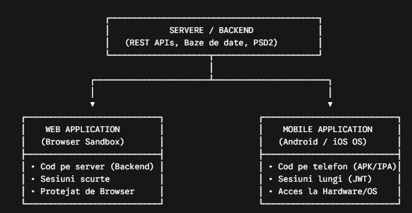

**Does a mobile app have more or fewer threats than a web app?**

**The mobile app has a larger and more complex attack surface (multiple types of threats).**

While both types of apps depend on the security of backend APIs, the mobile app introduces a whole class of **client-side threats that** web apps don't have:

1. **Web Application (Site):** Running takes place in a completely isolated environment from the browser (Browser Sandbox). The user or attacker does not download the complete source code of the application to his computer, but only temporary HTML/JS files.
2. **Mobile App (Android/iOS):** The full app package (.apk or .ipa file) is installed directly on the device's local storage. This gives the attacker direct physical access to the compiled binary code, allowing for offline static and dynamic analysis.

**Threat Comparison Chart**

| **Security Dimension** | **Web Application (Web Revolut)** | **Mobile Application (Android / iOS)** |
| --- | --- | --- |
| **Possession of the source code** | **Private.** The backend code (Java, Node.js, Go) remains on Revolut's servers. The client only sees HTML/JS. | **Public/Explained.** The binary (APK/IPA) is on the phone. It can be decompiled (JADX, Ghidra) to extract logic or APIs. |
| **Session Management** | **Short sessions.** Quickly expires when the tab is closed or after inactivity (based on HTTPOnly Cookies). | **Long sessions.** The user remains logged in for weeks/months using Refresh Tokens saved on disk for quick fingerprint/FaceID access. |
| **Running Environment** | **Controlled by the Browser.** The browser automatically applies strict rules (SOP - Same Origin Policy, XSS/CSRF protections). | **Hostile environment (Untrusted OS).** The phone can be Rooted (Android) or Jailbroken (iOS), voiding all operating system protections. |
| **Local Attack Vectors** | Limit yourself to Cross-Site Scripting (XSS) attacks or session hijacking through malicious browser extensions. | Local malware on the phone, Keyloggers, Overlay attacks (fake screen over the app), SMS/OTP interception, memory hooking (Frida). |
| **Security Updates** | **Snapshots.** A vulnerability resolved on the server protects 100% of users immediately. | **Slow.** Depends on the user to update their app from the App Store/Play Store. Old and vulnerable versions may remain active. |

**Mindset Shift: Pentest Web vs. Pentest Mobile**

The way of thinking of a penetration tester changes significantly depending on the target:

**a. Thinking in Web Pentesting: "Attack the Server through the Browser"**

* The main focus is on **client-server communication** and backend processing.
* Typical pentester questions: *"Can I inject SQL code into this form?", "Can I run XSS to steal the session cookie?", "Are there any CSRF or SSRF vulnerabilities on the server?"*
* The attack surface is focused on publicly exposed endpoints on the web.

**b. Thinking in Mobile Pentesting: "Attack the Binary, Local Storage, and Running Environment"**

* The focus becomes **hybrid**: on the one hand, the backend APIs are tested (just like on the web), but on the other hand,  **the application is attacked on the phone**.
* Typical Mobile Pentester Questions:
  1. **Binary inspection:** *"What information can I extract if I decompile the APK/IPA file? Are there secret keys or unpublished endpoints hardencoded in the code?"*
  2. **Storage Security:** *"What gets saved in SQLite databases, SharedPreferences, or system logs if the phone is stolen?"*
  3. **Dynamic Hooking:** *"If I'm using a framework like* ***Frida****, can I change the instructions in memory while the app is running to skip the PIN entry screen or disable fingerprint verification?"*
  4. **Network Integrity:** *"How can I bypass SSL Certificate Pinning protections to intercept and alter traffic between the application and the Revolut server?"*

**Differences Between Mobile Platforms: Android vs. iOS**

Within mobile analysis, there are specific differences between the two major operating systems:

* **Android (Open Ecosystem):**
  + It uses .apk/.aab packages based mainly on Java/Kotlin.
  + Decompilation is very easy (you get almost identical code to the source one using JADX).
  + Larger attack surface due to fragmentation of Android versions and flexible permissions (e.g. Accessibility permissions that malware can exploit for Overlay attacks).
* **iOS (Closed Ecosystem / Strict Sandbox):**
  + It uses .ipa packages compiled in native code (Swift/Objective-C) for ARM architectures.
  + Decompilation produces disassembled code (Assembly/Pseudocode C via Ghidra/Hopper), making it more difficult to analyze statically.
  + Apps are encrypted by Apple in the App Store (requires a Jailbroken device to decrypt the in-memory binary before analysis).
  + More rigid hardware security architecture (Secure Enclave), but vulnerable to Kernel/Jailbreak exploits on certain versions of iOS.

# Chapter 2: Analysis of Collected Data and Device-Level Risks

This chapter examines in detail the information footprint of the Revolut app on the mobile device and analyzes the threats to which this data is exposed in the event of loss, theft or compromise of the operating system.

## 2.1 System Architecture and Data Flow Diagram (DFD with Trust Boundaries)

In order to effectively identify the attack surface and the critical components of the mobile ecosystem (e.g. Revolut), it is necessary to map all the components that interact with the user's data and delineate the trust **boundaries**.

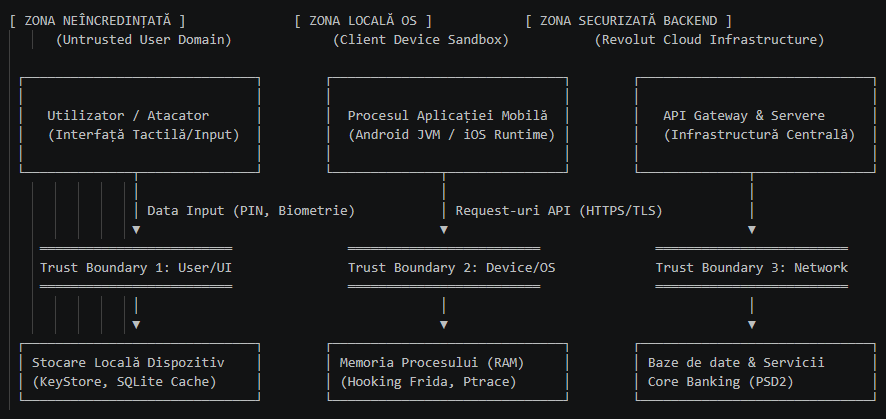

* **Description of Data Flows and Security Perimeters**
* **Flow 1 — Data Input (PIN, Biometrics):** Retrieving data from the user/interface to local storage and processing (goes through *Trust Boundary 1: User/UI).*
* **Risk:** Overlay attacks, keylogging or interception of locked screen data.
* **Stream 2 — Interaction with Process Memory:** Transition of instructions from the application runtime (Android JVM / iOS Runtime) to RAM memory (passes through *Trust Boundary 2: Device/OS).*
* **Risk:** Dynamic memory inspection, real-time function interception via Frida Hooking or unauthorized debugging (Ptrace).
* **Stream 3 — API requests (https/tls):** Transmitting requests from the mobile app to the central infrastructure (passes through *Trust Boundary 3: Network*).
* **Risk:** Interception of traffic by Man-in-the-Middle (MitM) attacks if SSL Pinning or the use of interception proxies (Burp Suite) are not applied.
* **Flow 4 — Backend Processing & Core Banking:** Data exchange between API Gateway, central servers, and databases/banking services (PSD2).
* **Risk:** API-level vulnerabilities (e.g., BOLA/IDOR, manipulation of session parameters, or unauthorized queries).
* **Trust Boundaries**
* **Trust Boundary 1 (User/UI):** Separates the user's untrustworthy domain (touch input and potential malware installed on the device) from the phone's local storage modules.
* **Trust Boundary 2 (Device/OS):** Separates the mobile app layer (standard sandbox) from the operating system and process RAM. Violation of this limit occurs on Root/Jailbreak phones.
* **Trust Boundary 3 (Network):** Delineates the local mobile environment (which can be connected to unsecured public Wi-Fi networks) from the secure cloud area of the Revolut infrastructure (Core Banking & API Gateway).

## 2.2 Classification of Collected and Processed Data

A modern financial technology (FinTech) application functions as a central data node. To comply with compliance requirements (KYC/AML) and provide personalized services, Revolut collects several categories of data, classified by sensitivity level:

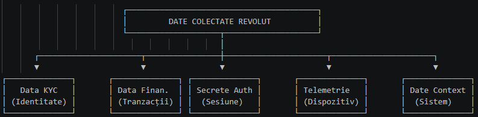

**A. Identification Data and KYC (Know Your Customer) — *Risk Level: Critical***

* **Civil status data:** Name, surname, date of birth, home address, citizenship, national identification number (CNP in Romania, SSN in USA).
* **Official documents:** Photos/scans of your ID card, passport, or driver's license.
* **Biometrics:** 3D facial scans (*Liveness Check*) used for registration and account recovery.

**B. Financial and Transactional Data — *Risk Level: High***

* **Account identifiers:** IBAN (multi-currency) codes, real-time balances, detailed transaction and P2P transfer history.
* **Payment instruments:** Physical and virtual card number (PAN), expiration date, and CVV/CVC code (for single-use, dynamically generated virtual cards).
* **Related portfolios:** Assets in cryptocurrencies, stocks, commodities (gold/silver) and savings products (Vaults).

**C. Secrets and Credentials — *Risk Level: Critical***

* **Credentials:** The app's PIN (passcode).
* **Session tokens:** OAuth 2.0 / JWT tokens (Access Token and Refresh Token) that keep the user authenticated.
* **Local biometric data:** Fingerprint/FaceID templates (managed directly by the OS, but used by the application through dedicated APIs).

**D. Telemetry and Context — *Risk Level: Medium***

* **Device Fingerprinting:** Phone model, operating system version, MAC address, IMEI/IDFV number, storage indicators.
* **Location data:** Precise GPS coordinates (used to protect against fraud on physical card payments).
* **Connection graph:** Your phone's contact list (for identifying other Revolut users and fast transfers).

## 2.3 Threat Scenarios: Lost, Stolen, or Compromised Device

According to the mobile security model, the physical device is considered an **untrusted environment**. Threats are divided into two major categories: attacks with physical access and attacks through the compromised operating system.

**Scenario 1: Physical Access (Lost or Stolen Phone)**

When an attacker gains physical access to the phone, their goals are to bypass lock screens and extract data from local storage.

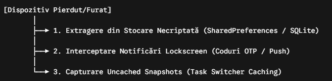

1. **Data extraction from Insecure Data Storage:**
   * **Mechanism:** If an application saves session tokens or account data in unencrypted preference files (SharedPreferences on Android or NSUserDefaults on iOS) or simple SQLite databases, the attacker can extract the files by connecting the phone to a computer via adb (Android Debug Bridge) or through backup utilities.
   * **Impact:** Unauthorized access to your account without knowing your PIN.
2. **Leaks through notifications on the lock screen:**
   * **Mechanism:** Notifications for OTP (One-Time Password) codes sent via SMS or Push notifications confirming transactions can be visible directly on the lock screen.
   * **Impact:** Bypass two-factor authentication (2FA) for online transactions.
3. **Inspect the Interface Cache (Task Switcher Snapshots):**
   * **Mechanism:** When the application is switched to the background, the operating system takes an automatic screenshot to display it in the Task Switcher. If the application does not mask the interface, the image saved unencrypted on the disk may contain the account balance or card details.

**Scenario 2: Compromised Operating System (Rooted/Jailbroken/Malware)**

In this scenario, the phone remains in the user's possession, but the security of the OS is overridden either intentionally by the user (Root/Jailbreak) or by malware infection.

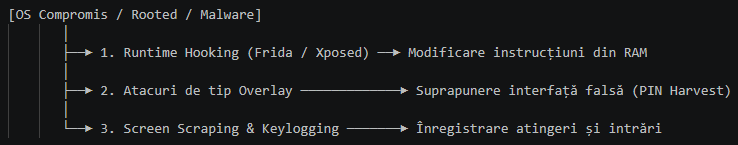

1. **Dynamic Analysis and Runtime Hooking (e.g. Frida, Xposed):**
   * **Mechanism:** On a device with root or jailbreak privileges, sandboxing disappears. An attacker or malware module can inject code into the Revolut app's process while it is running in RAM.
   * **Impact:** Changes to internal function return values (e.g. forcing a checkPin() function to return true regardless of the PIN entered) or disabling fingerprint verification calls.
2. **Overlay attacks:**
   * **Mechanism:** Using accessibility services or display permissions over other apps (specific to Android), a malicious app detects the opening of the Revolut app and instantly displays an identical login window on top of the real one.
   * **Impact:** User enters PIN in fake interface and credentials are captured by malware
3. **Keylogging and Screen Scraping:**
   * **Mechanism:** The malware uses extensive system permissions to record the coordinates of touches on the screen or take continuous screenshots while using the virtual keyboard.

## 2.4 Risk Matrix (Device-Level STRIDE)

To synthesize threats at the mobile device level, we apply the relevant components of the **STRIDE methodology**  (per-client analysis phase):

|  |  |  |  |  |  |  |
| --- | --- | --- | --- | --- | --- | --- |
| **Asset** | **Category STRIDE** | **Threat description** | **Impact (Risc)** | **Trust Boundary Breach** | **Control Defensiv (Remediation)** | **Risc Rezidual** |
| **Device Identifier** | **Spoofing** | Using a cloned emulator/device to impersonate the customer's legitimate device. | **High** | **Yes (Device Perimeter)** | Mandatory Multi-Factor Authentication (MFA) and Advanced Device Fingerprinting. | **Low** |
| **Code Compiled in RAM** | **Tampering** | Change the instructions of the in-memory binary (e.g. bypass UI with Frida). | **Critic** | **Yes (OS Sandbox)** | Implementation of RASP (Root & Hooking Detection) protections. | **Environment** |
| **Local Audit Logs** | **Repudiation** | Making a transaction from a compromised device and subsequently disputing it. | **Medium** | **No** | Cryptographic transaction signing (SCA) with hardware keys. | **Low** |
| **Local Storage (SQLite/Cache)** | **Information Disclosure** | Extracting keys from *SharedPreferences* or reading data from the unencrypted cache. | **Critic** | **Yes (Storage Layer)** | Save keys in *Android KeyStore* (Hardware-backed) and UI Hardening (clear cache). | **Low** |
| **Intent Components / Deep Links & UI Interface** | **Denial of Service** | Sending malformed Intents to exported components or fuzzing on Deep Link schemes to cause application crash (Local DoS), or blocking the account through repeated API requests. | **Medium** | **Yes (App IPC / REST API)** | Strict validation of input data (try-catch on Intent extracted), android:exported="false" setting, and Rate-Limiting/WAF implementation on the backend. | **Low** |
| **Process OS (iOS/Android)** | **Elevation of Privilege** | Exploiting OS kernel vulnerabilities to leave the application sandbox. | **Critic** | **Yes (OS Kernel)** | Applying FLAG\_SECURE and limiting operation on older versions of OS. | **Medium** |

### Trust Boundaries:

* **Device Perimeter:** The boundary between the user and the phone. A breach here means that the attacker has physically or virtually gained access to the screen.
* **OS Sandbox:** The limit imposed by the operating system between applications. Violation (via Root/Jailbreak) allows a malicious process to read the memory of the banking application.
* **Storage Layer:** The limit of data protection at rest. The breach allows the extraction of persistent files directly from the disk.

# DEMO: Practical Case Study — Reverse Engineering and Exploitation of OWASP M1 (Improper Credential Usage)

This section presents a practical demonstration of how the binary of an Android mobile app can be decompiled to extract improperly stored sensitive information. The experiment exemplifies the risk ranked first in the **OWASP Mobile Top 10** (*M1: Improper Credential Usage / Insecure Authentication*).

## Step 1: Create the demo app in Android Studio

A simple Android application has been developed in the **Android Studio** environment on the **Pop!\_OS Linux operating system**. The application simulates an authentication screen (LoginActivity), where the validation of credentials is done directly on the client side by comparing the data entered by the user with two constant variables (HARDCODED\_USER and HARDCODED\_PASS).

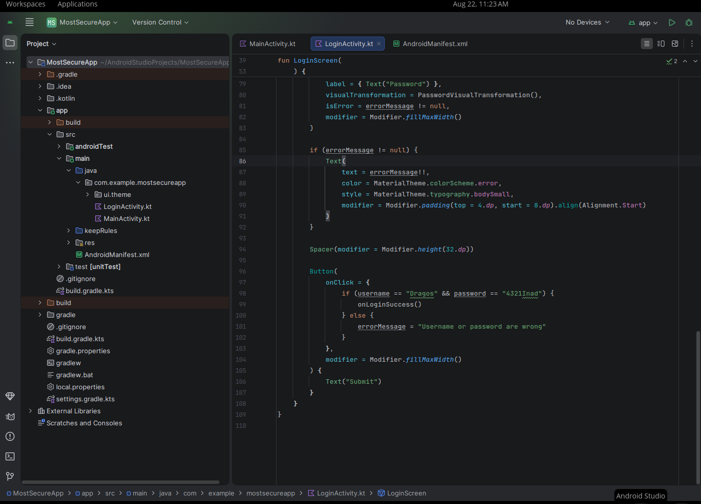

## Step 2: Generating the executable package .apk

After writing the code, the application was compiled to generate the executable binary package that users install on the device. From the Android Studio menu (*Build → Build APKs*), the app-debug.apk file was generated and renamed for most-secure-app.apk impact.

In the Pop!\_OS environment, the compiled binary file was located in the project's build directory: app/build/outputs/apk/debug/app-debug.apk

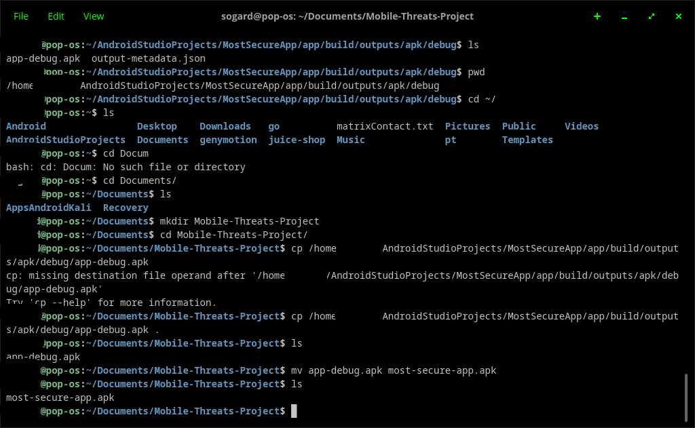

## Step 3: Decompile with JADX and discover credentials

Using the JADX-GUI **reverse engineering utility** installed on Pop!\_OS Linux, the app-debug.apk binary underwent a decompilation process to reconstruct the Java code from the .dex bytecode files.

An attacker doesn't have to read thousands of lines of code by hand. By using JADX's Global *Search* / Ctrl+Shift+F function and querying key terms such as password, user, or admin, hard-coded credentials were instantly identified in the LoginActivity class.

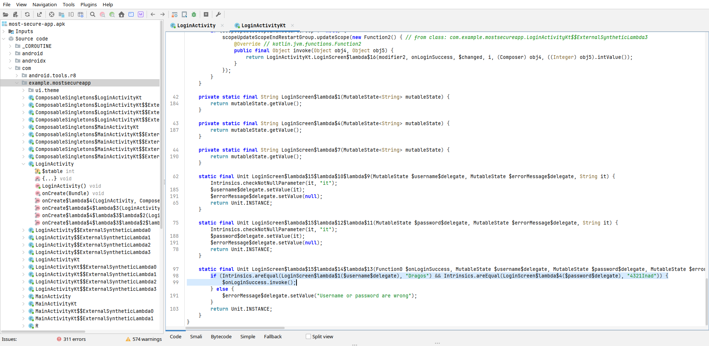

## Conclusion: Why is Improper Credential Usage at the top of the OWASP Mobile Top 10?

Identifying hard-coded credentials and misusing authentication occupies the **M1 position** in the OWASP Mobile ranking for several critical reasons:

1. **The binary is always on the attacker's device:** Unlike a web application where the backend code remains protected on the server, the mobile package (.apk / .ipa) is saved entirely on local storage. Without **obfuscation** measures (e.g. ProGuard / R8 / DexGuard) or cryptographic security in the hardware, the code is an "open book".
2. **Devastating Impact:** If the credentials stored in the code are general API keys, database passwords, or encryption secrets used by all users, compromising a single APK exposes the entire app infrastructure and its backend.
3. **Minimal Exploitation Effort:** As demonstrated in this demo, identifying the vulnerability doesn't require advanced hacking knowledge or expensive basic open-source utility tools like JADX, and a few seconds of analysis are enough.

**Benchmarking: Source Code vs. JADX Decompilation and Remediation (Before vs. After)**

The analysis performed on the MostSecureApp application shows exactly how instructions written in **Kotlin (Jetpack Compose)** are transposed into the .apk file and subsequently exposed in the **JADX-GUI decompiler**.

**1. Vulnerable version (source code vs. decompiled code)**

* **In Android Studio (Kotlin Source Code — LoginActivity.kt):** The app uses a local validation block on the *Submit* (onClick) button, directly comparing the username and password variables with the text values:

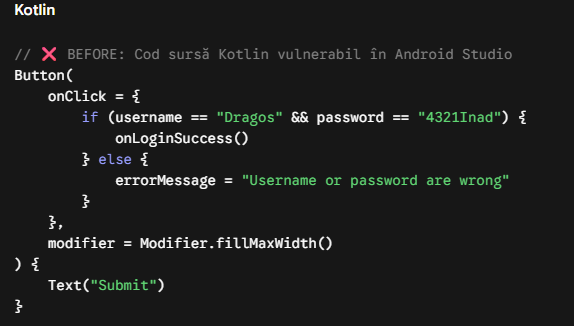

* **In JADX-GUI (Decompiled Code LoginActivityKt.java):** Although Kotlin compiles the code using Lambdas and Intrinsics.areEqual checks, the check values **remain completely unencrypted in memory** and are instantly identified:

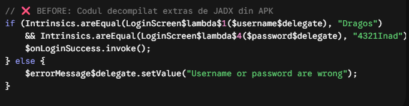

**2. Fixed version (AFTER — architectural fix)**

To completely eliminate the vulnerability, the verification logic is extracted from the graphical user interface (UI) and moved to the server.

* **In Android Studio (Secure Kotlin Code — LoginActivity.kt):** The source code no longer stores the values "Dragos" and "4321Inad". It sends a network authentication request:

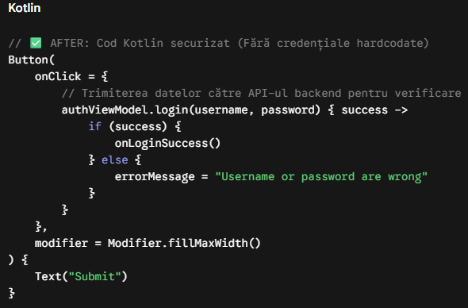

* **Even if the attacker finds the error message or password variable, there is no hard-coded value left in all the decompiled code. All they can see is that the application sends the data entered by the user to an external server for validation. Credentials can no longer be stolen from the .apk.3 binary. Practical conclusion**

The experiment demonstrates the fundamental rule of mobile security: **The mobile client is an *untrusted client***.

All executable .apk files can be read by decompiling. Any if (user == "..." && pass == "...") security check written locally on the phone provides an illusion of security and exposes the credentials of any user who uses analysis tools such as JADX.

**Conclusion:** Authentication validation should NEVER take place exclusively on the client side, and secrets or credentials should NEVER be stored directly in the source code of the mobile application.

# Chapter 3: API and Network Communications Risks

Modern mobile applications (including Revolut) work as a Rich Client. They depend almost 100% on a centralized infrastructure of APIs (REST/GraphQL) to execute transactions, check balance, or authorize users.

## 3.1 Network Traffic Interception: Man-in-the-Middle (MitM) Attacks

When a mobile application makes requests to the backend, the data travels through multiple network nodes (public Wi-Fi, mobile providers, intermediate routers).

* **Attack mechanism:** An attacker on the same network (e.g. Wi-Fi in a coffee shop) can configure an interception proxy (such as **Burp Suite** or **OWASP ZAP**) and generate a fake but trusted SSL/TLS certificate on the test phone.
* **Risk:** If the mobile app blindly accepts any certificate in the operating system's certificate store, the attacker can decrypt, read, and modify HTTPS traffic (including session tokens, transmitted PINs, and transaction data) in real time.

## 3.2 Mobile API-Specific Vulnerabilities

Once the traffic between the mobile app and the backend is intercepted or understood through decompilation, the attackers turn their attention directly to the server's APIs.

**a. BOLA / IDOR (Broken Object Level Authorization) — *Cel mai critic risc API***

* **Description:** Occurs when the API does not verify that the authenticated user has the right to access the requested resource.
* **Scenario on Revolut:** The application makes an HTTP request to get the transaction history: GET /api/v2/accounts/100452/transactions
* **Exploitation:** The pentester changes the 100452 parameter with 100453 in Burp Suite. If the server returns data to another client without checking if 100453 belongs to the current session, we have a massive BOLA/IDOR vulnerability.

**b. Broken Authentication & Token Mismanagement**

* **Description:** Poor handling of OAuth/JWT tokens.
* **Risks:**
* Passing authentication tokens to URLs as query parameters (GET /api/user?token=xyz), which results in them being saved in proxy server logs.
* Lack of proper expiration of *Refresh Tokens* or the possibility of reusing them after the user has pressed "Log Out".

**c. Excessive Data Exposure**

* **Description:** The API sends in the JSON response a complete data object from the database, relying on the mobile app to filter only the required fields on the screen.
* **Scenario:** When searching for a user by phone number for a P2P transfer, the API returns: first name, last name, profile picture, BUT AND home address, CNP, and account status. Even though the mobile interface only shows the name, the attacker sees all the response in Burp Suite.

## 3.3 Third-Party SDKs

Enterprise-grade applications integrate dozens of third-party libraries to:

* Analytics and telemetry (e.g. Google Analytics, Adjust, AppsFlyer).
* Bug and crash reporting (e.g. Firebase Crashlytics, Sentry).
* Customer Support / Chat (e.g. Intercom, Zendesk).

**Security Risk:** These SDKs run with the same privileges as the main application. If an unencrypted or misconfigured third-party SDK sends data in the background to its servers, it can unintentionally collect clipboard, geolocation data, or even snippets of financial responses, generating a data *leakage that is* difficult to detect.

## 3.4 Defensive Controls: Securing Communications and APIs

To counter these threats, Revolut apps implement advanced protections:

1. **SSL / TLS Certificate Pinning (Public Key Pinning):**
   * **How it works:** The mobile app contains hard-coded (or encrypted) the public certificate fingerprint (*hash*) of the legitimate Revolut server.
   * **Result:** When a request is made, the application compares the received certificate with the internally stored one. If an attacker tries to intercept traffic using a fake certificate (as Burp Suite does), the connection is instantly rejected.
2. **Parameter Grouping and Obfuscation (Custom Mutual TLS / HMAC Signing):**
   * Signing each API request with a dynamically generated cryptographic hash (HMAC) on the phone based on the body of the request and a temporary secret. If the attacker changes the transaction amount in Burp Suite, the signature becomes invalid and the server rejects the packet.
3. **Strict Authorization Validation on the Backend:**
   * The server must never trust the data coming from the mobile application. Each request must validate the session token rights directly against the database (preventing BOLA attacks).

# DEMO: Dynamic Analysis and Bypass of Login Screen Using Frida (Dynamic Method Hooking)

This second hands-on experiment exemplifies an advanced security technique: **dynamic analysis** and **process-level code** injection (Dynamic Instrumentation/Method Hooking) using the open-source **Frida framework**.

Unlike static disassembly (JADX), Frida allows intercepting and modifying instructions from the app's memory while it runs on the physical phone (OnePlus 7 Pro), without the need to change the .apk binary.

## Step 1: Preparing the Work Environment and Resetting the Processes and Starting the Frida Server on the Mobile Device

To guarantee a clean test state on the laptop with **Pop!\_OS Linux**, the com.example.mostsecureapp application process was first completely stopped and the residual Frida server sessions on the ADB-connected mobile phone were cleaned up.

Then on the physical phone (OnePlus 7 Pro with Root rights), the frida-server service located in /data/local/tmp/ was started in the background:

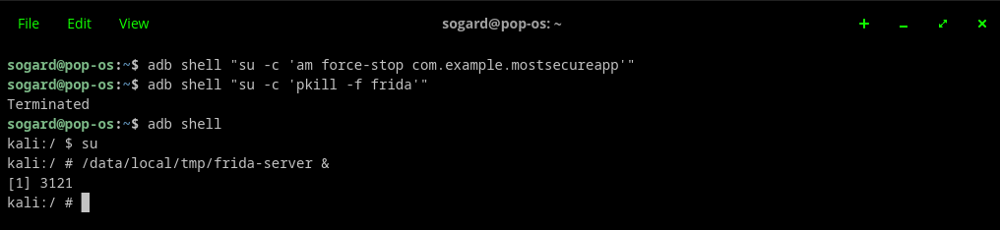

## Step 2: Creating the Bypass Script (bypass.js)

To bypass the login screen without entering credentials, a JavaScript script was created in the ~/Documents/Mobile-Threats-Project/bypass.js directory.

The script uses a modern Jetpack-based mechanism (androidx.activity.ComponentActivity), hooking on the onUserInteraction() method. At the first touch of the screen, the script dynamically creates a new Intent to MainActivity, forcing the app to load the main interface automatically:

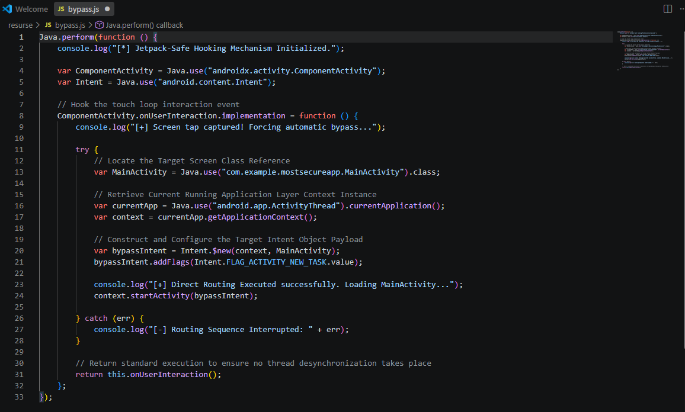

## Step 3: Identifying the PID and Injecting the Script

The MostSecureApp app was opened on the OnePlus 7 Pro screen (displaying the Login screen). From the Pop!\_OS terminal, the list of active processes on the phone was queried to identify the unique process ID (PID):

After identifying the corresponding PID for the application, the script bypass.js was injected directly into the active process in memory:

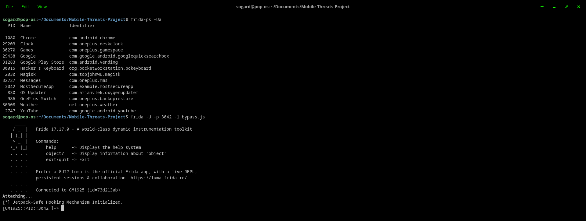

## Step 4: Attack Result and Bypass the Login Page

Once the script was successfully injected, a simple tap on the phone's screen (anywhere on the screen) was enough. Frida intercepted the touch event, executed the direct routing sequence, and instantly opened the MainActivity screen, completely ignoring the username and password validation.

## Conclusion: Why are RASP (Runtime Application Self-Protection) measures critical?

This demo demonstrates that an attacker with a rooted phone can manipulate the execution flow of an Android app in real-time.

To stop Frida-type attacks in financial applications, advanced RASP-like defensive measures are required:

* **Root & Debugger Detection:** Block application execution if a debug environment or Root binary is detected.
* **Anti-Frida Checks:** Scan local ports (e.g. port 27042) and process memory to detect the presence of the frida-server utility.
* **Code Integrity Protection:** Real-time verification if the code of classes in memory has been changed by hooking.
* **What the attack accomplished:** The Frida script only changed the local state in the process memory on the phone, forcing the Android operating system to display the MainActivity screen. It's a client/UI-level bypass.
* **Attack limit:** This bypass **does not compromise the account on the backend**. Without providing valid credentials on the Login screen, the central server does not issue an authenticated session token (e.g. OAuth/JWT token). As a result, any subsequent attempt in MainActivity to perform operations that require data from the server (API queries, transactions) will fail with an HTTP 401 Unauthorized error code.
* **Why is it still a security risk?** If the app keeps sensitive data cached locally on the device, or if the developers have made a **BOLA/IDOR architecture mistake**  (they don't check the session token on the backend for every action in MainActivity), the attacker could access sensitive information from the interface.

# Chapter 4: Essential Security Measures and Mobile Application Protection

To counter the static and dynamic attacks exemplified in the hands-on demonstrations, enterprise-level applications (especially those in the FinTech sector, such as Revolut) take a *Defense in Depth* approach. This combines international security standards with advanced code and execution protection technologies.

## 4.1 Standardul OWASP MASVS (Mobile Application Security Verification Standard)

**MASVS** is the worldwide reference framework used by security architects and auditors to design and evaluate mobile applications. The standard structures requirements on several levels of security:

| **MASVS Level** | **Guidance and Applicability** | **Description and Requirements** |
| --- | --- | --- |
| **MASVS-L1** | **Standard Security** (All Mobile Apps) | Establish the basic requirements for code hygiene: secure data storage, encrypted HTTPS/TLS communications, and proper session management. |
| **MASVS-L2** | **Defense-in-Depth** (FinTech/Banking Applications) | It adds tight controls for critical applications: multi-factor authentication (MFA), protections against complex network-level attacks, and rigorous transaction validation. |
| **MASVS-R** | **Resilience Against Reverse Engineering** | It is applied in combination with L1 or L2 to prevent binary parsing (decompilation) and dynamically modifying the code in memory. |

## 4.2 Code Obfuscation and Binary Protection (Anti-JADX)

As noted in **the JADX Demo**, unprotected source code compiled into .apk files can be almost entirely disassembled with utilities such as JADX. To prevent this vulnerability, obfuscation techniques are used:

* **Minification and Rename of Identifiers (ProGuard / R8 / DexGuard):** Rename of descriptive classes, methods and variables (e.g. LoginActivity, verifyLogin()) into names with no contextual meaning (e.g. a, b.a()), massively making manual analysis more difficult.
* **String Encryption:** All text constants, API URLs, and cryptographic keys are stored in encrypted binary form and decrypted only dynamically, in memory, at runtime.
* **Control Flow Obfuscation:** Altering the algorithmic structure of the code by adding *dead code* and complex loops, without changing the final result, to confuse automatic disassemblers.

## 4.3 Runtime Application Self-Protection (RASP)

To block the **Method Hooking** and **Memory Code Injection attacks**  demonstrated in **Frida Demo 2**, the application must be aware of the environment in which it is running and protect itself:

* **Debugging and Root Media Detection:** The app continuously checks if it is running in an emulator, if the device has Root access (/system/app/Superuser.apk or its binary), or if an external debugger is attached (android.os.Debug.isDebuggerConnected()).
* **Anti-Frida Protection:** The application scans the process memory and internal network ports (e.g. port 27042 used by default by frida-server) and verifies the integrity of the files in /proc/self/maps. If a hook is detected, the application closes its process instantly.
* **Integrity Checking (Anti-Tampering):** Verification of the digital signature of the APK package and the checksum of the bytecode at startup, to prevent an attacker from modifying and recompiling the binary.

## 4.4 Biometric Authentication and Secure Storage of Secrets

Storing credentials or session tokens directly in text files, SharedPreferences, or source code is a serious design mistake.

1. **Android Keystore System:** Use of the dedicated hardware module (*Hardware-backed Keystore / TEE - Trusted Execution Environment*) to generate and store cryptographic keys. The keys never leave the phone's secure hardware chip.
2. **Biometric Authentication (BiometricPrompt API):** Raising the level of security through the integration of fingerprint sensors or facial recognition. Encryption of sensitive data is directly related to successful biometric user authentication.
3. **EncryptedSharedPreferences:** Automatic encryption of configuration data and local tokens using keys managed through Android Keystore, preventing them from being read in case the device is lost or extracted via backup.

## 4.5 Risks of Downloading Apps from Unofficial Sources (Sideloading)

In mobile ecosystems, installing apps from third-party sources or unofficial stores (a process known as **Sideloading** — manually installing .apk files on Android or through modified packages on iOS) is one of the biggest vectors of infection.

Unlike official stores (**Google Play Store** and **Apple App Store**), which use advanced automatic scanners (Google Play Protect), real-time behavioral analysis, and manual developer verification, third-party sources do not offer security guarantees.

**Main Types of Threats Specific to Sideloading**

### 1. Modified Applications / Repackaged Malware (Droppers)

* **Description:** Attackers download a popular legitimate application or paid game, use reverse engineering tools (similar to those shown in demos) to disassemble the binary, inject a malicious code module (payload/Trojan), and recompile the .apk package.
* **Risk:** The user thinks they are installing a "free" or "modified" version of a real app, but in the background they are running malicious code that takes control of the device or steals personal data.

### 2. Banker Trojans and Overlay Attacks

* **Description:** Malicious apps specifically designed to target financial apps (such as Revolut).
* **Mechanism:** The malware detects when the user opens the legitimate banking app and instantly displays a fake login window above the real one (**Overlay Attack**). The user enters their login or PIN believing they are in the banking app, giving attackers direct access to their account.

### 3. Spyware and Infostealers

* **Description:** Malware designed to spy on the user's activity in the background without their consent.
* **Mechanism:** Once installed from insecure sources, the application asks for excessive permissions (Accessibility, SMS, Contacts, Microphone, Storage). It can intercept **2FA/OTP verification codes received via SMS**, record keystrokes (*Keylogging*), or transmit contact list and private files to a command and control server (C2).

### 4. Ransomware Mobil

* **Description:** Malicious code that blocks the user's access to the device or encrypts their personal files (photos, documents), demanding a ransom (usually in cryptocurrency) for unlocking.
* **Mechanism:** It spreads almost exclusively through packages .apk downloaded from pirate sites or deceptive advertisements (*Malvertising*).

### 5. Android Accessibility Services Exploitation

* **Description:** Accessibility services in Android are designed to help users with disabilities by giving apps permission to read the screen and perform simulated taps.
* **Risk:** Unofficially downloaded malware tricks the user into granting it accessibility permissions. Once obtained, the malicious application can conduct financial transactions in the background, approve other dangerous permissions on its own, and protect itself against uninstallation.

**Defensive Measures and Recommendations for Users**

1. **Disable Install from Unknown Sources:** Keep the *"Install from unknown sources"*  option disabled in Android settings.
2. **Exclusive Use of Official Stores:** Download apps only from the Google Play Store or Apple App Store.
3. **Checking Permissions Requests:** A simple flashlight app or game should never request access to SMS, Accessibility Services, or Contacts.
4. **Google Play Protect Protection:** Keep the built-in periodic scan module active on your Android system.

# Final Conclusions and Personal Contributions

This project provided a technical and practical perspective on the mobile application security ecosystem, taking a close look at the threats to modern FinTech financial systems.

### Main Knowledge and Skills Acquired

1. **Difference Between Static and Dynamic Analysis:**
   * Through **Demo 1 (JADX),** it was understood how vulnerable executable binary code is .apk in the absence of rigorous obfuscation techniques (ProGuard/R8). The extraction of hardcoded credentials showed why **OWASP M1: Improper Credential Usage** ranks first in the ranking of mobile risks and why no sensitive information or critical authentication logic should be left exclusively on the *client-side*.
   * Through **Demo 2 (Frida),** the concept of *Dynamic Instrumentation* on a physical device (OnePlus 7 Pro) was explored. It has been shown that static analysis is not the only attack vector; an attacker with Root access can manipulate the execution flow from memory in real time through *method hooking* (intercepting onUserInteraction()), completely bypassing authentication screens without altering the binary on disk.
2. **Defense in Depth *Architecture*:**
   * Practical experience has demonstrated the need to implement active defensive controls. The protection of modern mobile applications cannot be based on a single mechanism, but requires a multi-layered approach: encryption of data at rest (*Android Keystore*), securing network communications (*SSL/TLS Pinning*), binary protection (*Obfuscation*) and self-protection at the execution level (**RASP** - Root detection, Anti-Frida, Anti-Debug).
3. **Pentester Thinking (Security Mindset):**
   * Building your own app in Android Studio and then disassembling/intercepting it on a Linux platform provided an overview of the secure software development lifecycle (DevSecOps), confirming the principle that in order to effectively protect a mobile app, you must first understand how an attacker will analyze and exploit it.

### Bibliography and Reference Resources

1. **OWASP Foundation** (2024). *OWASP Mobile Application Security Top 10*. Sursă online: <https://owasp.org/www-project-mobile-top-10/>
2. **OWASP Foundation** (2024). *OWASP Mobile Application Security Verification Standard (MASVS)*. Version 2.0.0. Sursă online: [https://masvs.owasp.org/](https://www.google.com/search?q=https://masvs.owasp.org/)
3. **OWASP Foundation** (2023). *OWASP API Security Top 10*. Sursă online: <https://owasp.org/www-project-api-security/>
4. **Android Developers Documentation** (2025). *App security best practices*. Google Android Open Source Project. Sursă online: <https://developer.android.com/topic/security/best-practices>
5. **Android Developers Documentation** (2024). *Android Keystore System & Hardware-backed Security*. Google. Sursă online: <https://developer.android.com/training/articles/keystore>
6. **Skylined & JADX Contributors** (2024). *JADX - Java decompilation tools for Android DEX and APK files*. Repository GitHub: <https://github.com/skylot/jadx>
7. **Ravat, O. & Frida Developers** (2025). *Frida: Dynamic instrumentation toolkit for developers, reverse-engineers, and security researchers*. Sursă online: <https://frida.re/docs/home/>
8. **Elenkov, N.** (2014). *Android Security Internals: An In-Depth Guide to Android's Security Architecture*. No Starch Press. ISBN: 978-1593275815.
9. **Thoviti, S. (2024). *Threat Modeling using LLM: Asset Threat Model Table and Trust Boundaries Methodology*. Sursă online:** [**https://sidthoviti.com/threat-modeling-using-llm/**](https://sidthoviti.com/threat-modeling-using-llm/)
10. **European Union Agency for Cybersecurity (ENISA)** (2023). *Smartphone Security for Citizens: Guidelines and Risk Assessment*. ENISA Publications. Sursă online: <https://www.enisa.europa.eu/>
11. **Stuttard, D., & Pinto, M.** (2011). *The Web Application Hacker's Handbook: Finding and Exploiting Security Flaws* (2nd Edition - Mobile Network & API Security Chapters). Wiley. ISBN: 978-1118026472.